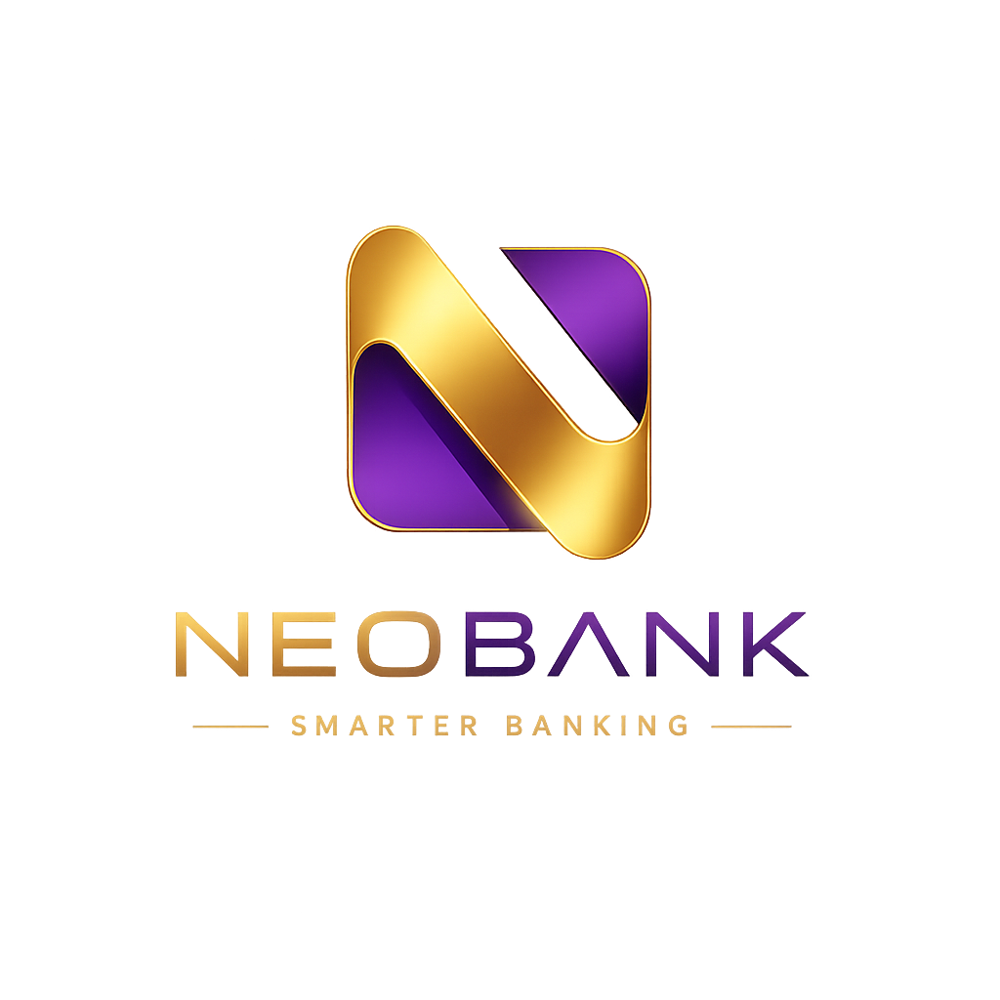

<p align="center">
  
</p>

## 🏦 Neobank: Next-Gen Digital Banking Platform

> **Digital bank with cards, loans, deposits, real-time AI support, and a comprehensive admin panel.**

Welcome to **Neobank** — a premium, modern banking web application built to provide a seamless financial experience. From managing cards to chatting with support agents in real-time and administering the entire system via a powerful dashboard, Neobank delivers a visually stunning and robust banking environment.

---

## ✨ Key Features

### 👤 User Features
- **💳 Card Management**: Order, view, and manage digital credit/debit cards, block cards, and change limits.
- **💸 Smart Transactions**: Instant internal transfers, IBAN transfers, and utility payments.
- **📈 Loans & Deposits**: Flexible loan applications and high-yield deposit management.
- **💬 Real-Time Support**: A powerful customer service chat using SignalR for real-time issue resolution.
- **🛍️ Cashback System**: Track rewards and cashbacks on purchases across various categories.
- **📄 Document Generation**: Order official bank references and certificates directly from the app.
- **📷 QR Code Scanner**: Scan QR codes for quick actions and payments.

### 🛡️ Admin Dashboard Features
- **👥 User Management**: View users, assign roles, block/unblock, and send emails directly.
- **💬 Support Management**: Handle user tickets in real-time with an integrated chat interface and overall rating tracking.
- **💰 Loans & Cashbacks**: Approve/reject loan applications and configure global cashback categories.
- **🗄️ Database Tools**: Manage database configurations and backups directly from the UI.
- **🎨 Content Management**: Edit homepage banners and footer links dynamically.

### 💫 Premium UI/UX
- **Smooth Morphing Modals**: Innovative, perfectly animated morphing modals across user and admin pages.
- **Dark Mode Aesthetic**: Deep dark themes with gold and purple glassmorphism accents.
- **Multi-Language Support**: Fully localized in English, Russian, and Azerbaijani.

---

## 🛠️ Tech Stack

### **Frontend (Client)**
- **React 19** (Vite 8)
- **SCSS / CSS3** (Custom design system, fluid animations)
- **React Router v7**
- **SignalR Client** (Real-time chat)
- **Stripe Elements** (Secure payment processing)
- **Custom Context API** (Localization & Auth)

### **Backend (Server)**
- **ASP.NET Core 10 Web API**
- **Entity Framework Core 10** (Code-first architecture)
- **PostgreSQL** (Relational Database)
- **SignalR** (WebSockets for real-time communication)
- **Stripe API** (Payment Gateway integration)
- **JWT Authentication** (Secure stateless sessions)

---

## 📁 Project Structure

```text
neobank-client/
├── src/                      # Frontend React application
│   ├── app/                  # Contexts, Hooks, Store
│   ├── assets/               # Images, SVGs, global SCSS styles
│   ├── components/           # UI Components
│   │   ├── AdminPages/       # Admin Dashboard (Users, Support, Loans, Database, etc.)
│   │   ├── UserPages/        # User Dashboard (Cards, Payments, History, Settings)
│   │   ├── PublicPages/      # Landing, Auth, Info pages
│   │   ├── SupportPages/     # SignalR Chat Interface
│   │   └── common/           # Shared UI elements (MorphModal, Loader, etc.)
```

---

## 🚀 Getting Started

### Prerequisites
- Node.js (v18+)
- .NET 10 SDK
- PostgreSQL
- Stripe Account (for payments)

### 1️⃣ Clone the repository
```bash
git clone https://github.com/elchinima/Neobank-App.git
cd Neobank-App/neobank-client
```

### 2️⃣ Run the Frontend
```bash
# Install dependencies
npm install

# Start the Vite development server
npm run dev
```
The frontend will be available at `http://localhost:5173`.

### 3️⃣ Run the Backend
1. Navigate to the server API directory:
   ```bash
   cd server/NeoBank.Api
   ```
2. Update the `appsettings.json` with your database connection strings, JWT secret, and Stripe keys.
3. Apply database migrations:
   ```bash
   dotnet ef database update
   ```
4. Run the API:
   ```bash
   dotnet run
   ```
The backend will run on `https://localhost:7196` (or similar).

---

## 🔒 Security & Performance
- **Authentication**: Secured with JWT bearer tokens.
- **Real-Time Data**: WebSocket connections via SignalR are authenticated and handled asynchronously.
- **Optimized UI**: Custom morphing animations are hardware-accelerated for smooth 60fps performance.

---

<p align="center">
  <i>Developed with ❤️ for the Code Academy Final Project.</i>
</p>
